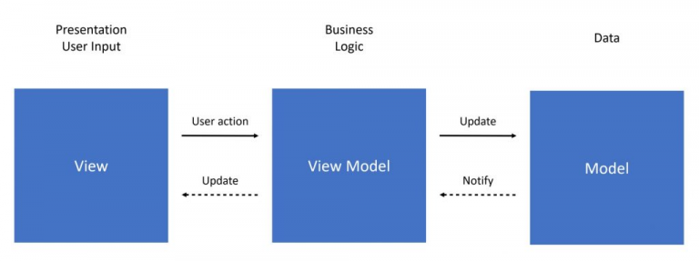

# flutter_meetup

Aplicación desarrollada en Flutter para organizar los eventos realizados por Globant

## - Funcionalidades
* Busqueda de eventos
* Creación de eventos
* Favoritos
* Dark mode

## - Tecnologias utilizadas
* Provider
* Firebase
* Firestore
* Google sign in
* Material Design

## - Repository Pattern

El proyecto utiliza el patrón repositorio con ayuda de provider.

 

## - Testing:

## Screenshots
| Home | Explore | Profile |
|:-:|:-:|:-:|
|  |  |  |
| Home Dark | Search Dark|  Home Loaded Dark | Details Dark |
|  |  |  |

### Desarrollado por

Brahian Martinez | brahian.martinez@globant.com

Gabriel Neira | gabriel.neira@globant.com

### License

GNU GENERAL PUBLIC LICENSE
Version 3, 29 June 2007

Copyright (C) 2007 Free Software Foundation, Inc. <https://fsf.org/>
Everyone is permitted to copy and distribute verbatim copies
of this license document, but changing it is not allowed.

-------
